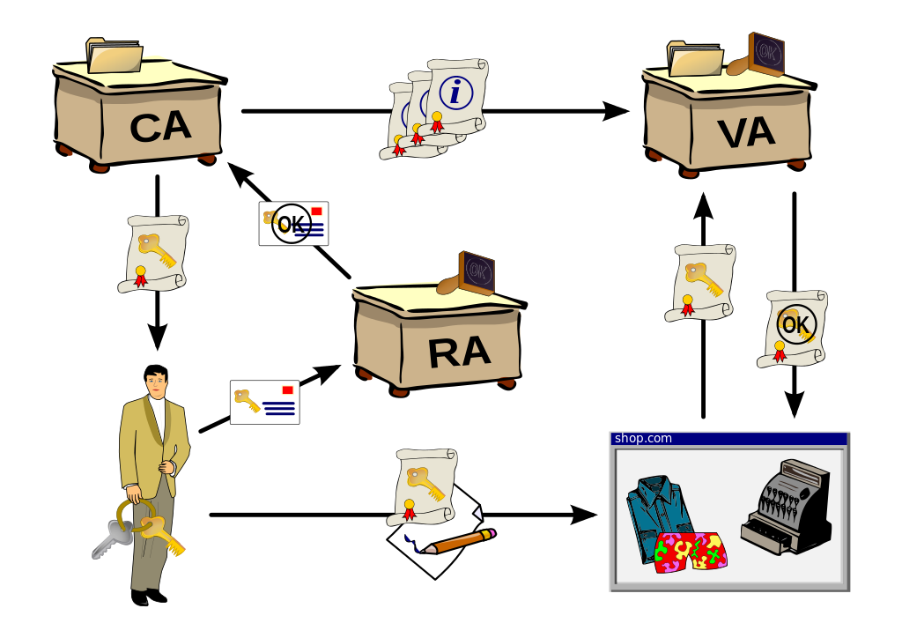

# Chapter 6 Cryptography and PKI

```
6.1 密碼學基本觀念
Compare and contrast basic concepts of cryptography.

■■ Symmetric algorithms
■■ Modes of operation
■■ Asymmetric algorithms
■■ Hashing
■■ Salt, IV, nonce
■■ Elliptic curve
■■ Weak/deprecated algorithms
■■ Key exchange
■■ Digital signatures
■■ Diffusion
■■ Confusion
■■ Collision
■■ Steganography
■■ Obfuscation
■■ Stream vs. block
■■ Key strength
■■ Session keys
■■ Ephemeral key
■■ Secret algorithm
■■ Data-in-transit
■■ Data-at-rest
■■ Data-in-use

■■ Random/pseudo-random number generation
■■ Key stretching
■■ Implementation vs. algorithm selection
■■ Crypto service provider
■■ Crypto modules
■■ Perfect forward secrecy
■■ Security through obscurity
■■ Common use cases
■■ Low power devices
■■ Low latency
■■ High resiliency
■■ Supporting confidentiality
■■ Supporting integrity
■■ Supporting obfuscation
■■ Supporting authentication
■■ Supporting non-repudiation
■■ Resource vs. security constraints

6.2 密碼學演算法
Explain cryptography algorithms and their basic characteristics.
[]Symmetric algorithms
■■ AES
■■ DES
■■ 3DES
■■ RC4
■■ Blowfish/Twofish
■■ Cipher modes
■■ CBC
■■ GCM
■■ ECB
■■ CTM
■■ Stream vs. block

[]Asymmetric algorithms
■■ RSA
■■ DSA
■■ Diffie-Hellman
■■ Groups
■■ DHE
■■ ECDHE
■■ Elliptic curve
■■ PGP/GPG

[]Hashing algorithms雜湊演算法
■■ MD5
■■ SHA
■■ HMAC
■■ RIPEMD

[]Key stretching algorithms
■■ BCRYPT
■■ PBKDF2

[]Obfuscation
■■ XOR
■■ ROT13
■■ Substitution ciphers


6.3 無線網路安全 設定 技術
Given a scenario, install and configure wireless security settings.
[]加密協定Cryptographic protocols
   WEP
   WPA
   WPA2
   WPA3
   CCMP
   TKIP

[]身分認證協定Authentication protocols
■■ EAP
■■ PEAP
■■ EAP-FAST
■■ EAP-TLS
■■ EAP-TTLS
■■ IEEE 802.1x
■■ RADIUS Federation

[]Methods
■■ PSK vs. Enterprise vs. Open
■■ WPS
■■ Captive portals


6.4 公開金鑰基礎建設 (Public key infrastructure)
Given a scenario, implement public key infrastructure.

[]Components
■■ CA
■■ Intermediate CA
■■ CRL
■■ OCSP
■■ CSR
■■ Certificate
■■ Public key
■■ Private key
■■ Object identifiers (OID)


[]Concepts
■■ Online vs. offline CA
■■ Stapling
■■ Pinning
■■ Trust model
■■ Key escrow
■■ Certificate chaining


[]Types of certificates
■■ Wildcard
■■ SAN
■■ Code signing
■■ Self-signed
■■ Machine/computer
■■ Email
■■ User
■■ Root
■■ Domain validation
■■ Extended validation

Certificate formats[憑證格式]:DER  PEM  PFX CER P12  P7B
```
### 6.4 公開金鑰基礎建設 (Public key infrastructure)

```
https://en.wikipedia.org/wiki/Public_key_infrastructure

認證機構（Certification Authority,CA）（頒發憑證的人或機構）
序號產生器構（Registration Authority,RA）

```

